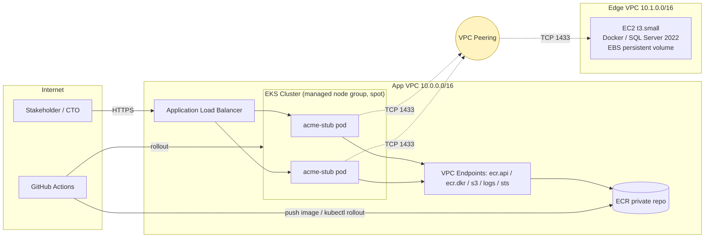

# Architecture

Two-VPC topology mirroring the ADR 003 Enterprise Edge pattern. The application
tier in the App VPC has no awareness of where SQL Server lives — in production
the peering link is swapped for Direct Connect to the on-prem data centre and
nothing else changes.

## Trust boundaries

| From | To | Allowed |
|---|---|---|
| Internet | ALB | 443 (and 80 redirect) |
| ALB target group | Pod :8080 | Cluster-internal |
| EKS node SG | Edge SQL SG | TCP 1433 only, from `10.0.0.0/16` CIDR |
| Stakeholder IAM user | AWS console | `ReadOnlyAccess` + EKS read RBAC |
| Stakeholder SQL login | SQL Server | `SELECT` on `dbo` only |

## Deviations from the source spec

1. **Edge SQL on EC2, not RDS.** The architecture table mentioned RDS for SQL
   Server Express; the detailed phase notes specified an Edge VPC with EC2 +
   Dockerised SQL Server to mirror ADR 003. The Edge VPC pattern won — it is
   the more faithful preview of the target topology.
2. **No NAT gateway.** Replaced with VPC interface endpoints for ECR/STS/Logs
   and a gateway endpoint for S3. Saves ~$30 over the demo window and is closer
   to production posture than nodes-in-public-subnets-with-public-IPs.
3. **EKS access entries, not the `aws-auth` ConfigMap.** EKS module v21
   defaults to `authentication_mode = "API_AND_CONFIG_MAP"` and exposes
   `access_entries` for IAM principal mapping. The ConfigMap path is legacy.
